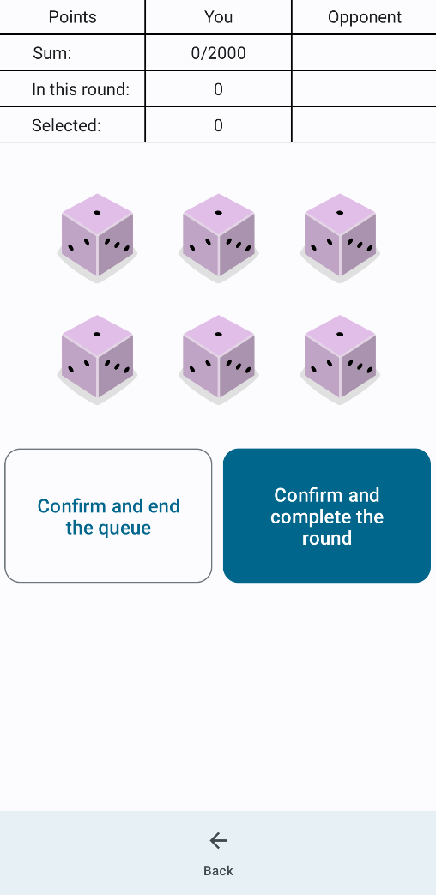

# DicesGame
This is a mobile game on Android inspired minigame from a PC game called Kingdome Come: Deliverance.
It consists of rolling 6 dice, and choosing the ones that will give you the most points.
When on the board there aren't any pair of dices that will give any points, then it is skucha, which ends the round.
The player who gets 2000 points wins. Feel free to commit to this project.

Jetpack Compose and Kotlin are used. Work in progress

<table>
  <tr>
    <td></td>
    <td></td>
  </tr>
</table>

